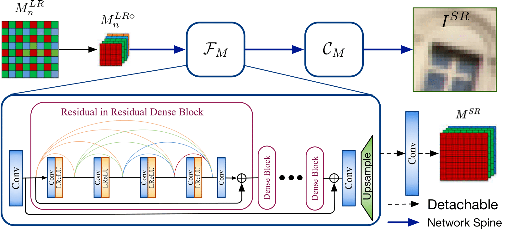

# TENet <a href="https://arxiv.org/abs/1905.02538" target="_blank">[PDF]</a> <a href="http://gcqian.com/project/pixelshift200">[pixelshift200]</a> 

### Rethink the Pipeline of Demosaicking, Denoising, and Super-resolution
By [Guocheng Qian](https://guochengqian.github.io/), [Yuanhao Wang](https://github.com/yuanhaowang1213), Chao Dong, [Jimmy S. Ren](http://www.jimmyren.com/), Wolfgang Heidrich, Bernard Ghanem, [Jinjin Gu](http://www.jasongt.com/)

The original name of this project is: "Trinity of Pixel Enhancement: a Joint Solution for Demosaicking, Denoising and Super-Resolution"


## pipeline DN -> SR -> DM


## TENet

We insert the proposed pipeline DN -> SR -> DM into an end-to-end network constructed by RRDB for the joint DN, DM and SR. We leverage the detachable branch to provide the middle stage supervision. 

<p align="center">
  
</p>


## PixelShift200 dataset


## Resources

* pretrained models
* Pixelshift200: 
* Real-shot raw images:

Will be available soon. 


### Enviroment installnation

Clone this github repo and install the environment by:

```shell
git clone https://github.com/guochengqian/TENet
cd TENet
source env_install.sh
conda activate tenet
```


### Data preparation

1. synthetic data preparation

   1. Download ([DIV2K](https://drive.google.com/file/d/1vXPPr2hVaMewz2JA1lFfI5uHB4ENwRXQ/view?usp=sharing)) dataset

   2. create data directory in TENet folder: `mkdir data && cd data`

   3. Link DIV2K data into ./data/DIV2K, e.g. `ln -s /data/lowlevel/DIV2K ./` 

   4. Crop DIV2K

      ```bash
      cd ../datasets
      python crop_imgs.py --src_dir ../data/DIV2K/DIV2K_val5_HR --save_dir ../data/DIV2K/DIV2K_val5_HR_sub # crop val5 images
      python generate_datalist_div2k.py  # generate div2k training and val dataset
      ```
      
The generated .txt file  `train_div2k.txt` and `val_div2k.txt` are used for training on DIV2K.     
   
2. PixelShift200 data preparation 

   1. Download [Pixelshift200]. They are .mat format, having 4 channels (R, Gr, Gb, B). Unzip the .zip file and put all folders inside into one folder called pixelshift200. For example, put here `/data/pixelshift200`. 

   3. Link PixelShift200 data into ./data/pixelshift200, e.g. `cd TENet/data && ln -s /data/pixelshift200 pixelshift200` 

   4. Crop images into 512*512, and generate the text file contains the location of each image:

      ```shell
   cd ../datasets
      python crop_pixelshift200.py 
      python generate_datalist_pixelshift.py 
      ```
   
      The generated .txt file  `train_pixelshift.txt` (9444 Lines) and `val_pixelshift.txt` (20 Lines) are used for training. check them. 

      

 

## Training
#### Train  joint  models: 

* DN+DM+SR (end to end without pipeline)

  ```shell
  python train.py --in_type noisy_lr_raw --mid_type None --out_type linrgb --model tenet --train_list datasets/train_pixelshift.txt --val_list datasets/val_pixelshift.txt --n_gpus 4  --use_wandb --block_type rrdb --n_blocks 6 --imgs_per_gpu 8
  ```

* DN+SR->DM (our TENet)

  ```SHELL
  python train.py --in_type noisy_lr_raw --mid_type raw --out_type linrgb --model tenet --train_list datasets/train_pixelshift.txt --val_list datasets/val_pixelshift.txt --n_gpus 4  --use_wandb --block_type rrdb  --n_blocks 6  --imgs_per_gpu 8
  ```

  Note: 

  1.  `--mid_type raw` is to activate the auxiliary mid stage supervision. Here we add `raw` as the supervision, therefore, the pipeline will be DN+SR->DM.

  2.  for training on a different dataset, like DIV2K, change `--train_list datasets/train_div2k.txt --val_list datasets/val_div2k.txt` 

  3.  for using a different building block, such as NLSA `--block_type nlsa`, or EAM `--block_type eam` , or RRG `--block_type rrg`, or DRLM `--block_type drlm` or RRDB `--block_type rrdb`

  4.  Monitor your jobs using Tensorboard (log saved in ./log folder by default, `tensorboard --logdir=./ ` ) or using wandb (online website) by set `--use_wandb`. 


#### Train sequential models: 

```shell
# RawDN
python train.py --in_type noisy_raw --out_type raw --model resnet --train_list datasets/train_pixelshift.txt --val_list datasets/val_pixelshift.txt --n_gpus 4  --use_wandb --block_type rrdb --n_blocks 6

# RawSR
python train.py --in_type lr_raw --out_type raw --model resnet --train_list datasets/train_pixelshift.txt --val_list datasets/val_pixelshift.txt --n_gpus 4  --use_wandb --block_type rrdb --n_blocks 6

# DM
python train.py --in_type raw --out_type linrgb --model resnet --train_list datasets/train_pixelshift.txt --val_list datasets/val_pixelshift.txt --n_gpus 4  --use_wandb --block_type rrdb --n_blocks 6

# RGBDN
python train.py --in_type noisy_linrgb --out_type linrgb --model resnet --train_list datasets/train_pixelshift.txt --val_list datasets/val_pixelshift.txt --n_gpus 4  --use_wandb --block_type rrdb --n_blocks 6

# RGBSR
python train.py --in_type lr_linrgb --out_type linrgb --model resnet --train_list datasets/train_pixelshift.txt --val_list datasets/val_pixelshift.txt --n_gpus 4  --use_wandb --block_type rrdb --n_blocks 6
```


### Train SOTA models
* JDSR
  ```SHELL
  python train.py --in_type noisy_lr_raw --mid_type None --out_type linrgb --model jdsr --train_list datasets/train_pixelshift.txt --val_list datasets/val_pixelshift.txt --n_gpus 4  --use_wandb --block_type res --n_blocks 12 --channels 256
  ```

* JDnDmSR

  ```SHELL
  python train.py --in_type noisy_lr_raw --mid_type lr_raw --out_type linrgb --model jdndmsr --scale 2 --train_list datasets/train_pixelshift.txt --val_list datasets/val_pixelshift.txt --n_gpus 4 --n_blocks 2 --block rcab
  ```


## Testing

```shell
bash script_all_pipelines.sh 
# this script supports evaluation on all benchmarking datasets as well as the real-shot images for all possible pipelines
```

Note: for the real shot images testing, you have to:

1.  save the real-shot image as a readable raw image (like in .RAW, .ARW, .DNG format).  For example,  we use Lightroom mobile version to shot images on iPhone and save the photo in .DNG format.
2. Read the general metadata using RawPy and read the noise profiling metadata using [Jeffrey's Image Metadata Viewer](http://exif.regex.info/exif.cgi) or [metapicz](http://metapicz.com/). 


### Citation 

Please cite the following paper if you feel TENet is useful to your research

```
@article{qian2019trinity,
  title={Rethink the Pipeline of Demosaicking, Denoising, and Super-resolution},
  author={Qian, Guocheng and Wang, Yuanhao and Dong, Chao and Ren, Jimmy S and Heidrich, Wolfgang and Ghanem, Bernard and Gu, Jinjin},
  journal={arXiv preprint arXiv:1905.02538},
  year={2019}
}
```

