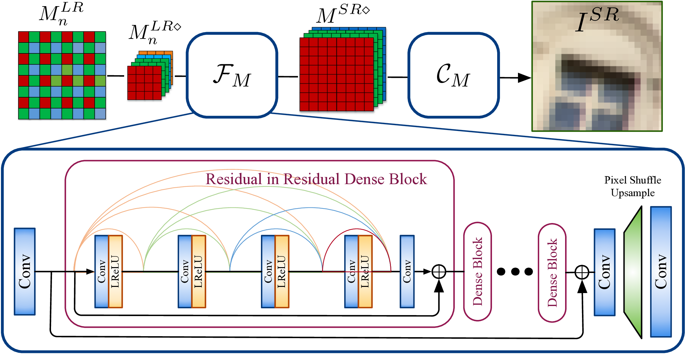
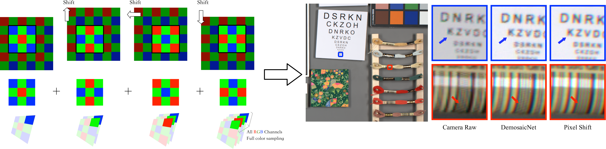

# TENet <a href="https://arxiv.org/abs/1905.02538" target="_blank">[PDF]</a> <a href="https://drive.google.com/drive/folders/1iOopGVTnX1IZIs2XtLZOZjUyNt-tU8BX?usp=sharing">[Checkpoints]</a>
<!--<a href="https://arxiv.org/abs/1905.02538" target="_blank">[pre-trained models]</a> -->
<!--<a href="https://arxiv.org/abs/1905.02538" target="_blank">[datasets]</a> -->
### Trinity of Pixel Enhancement: a Joint Solution for Demosaicing, Denoising and Super-Resolution
By [Guocheng Qian](https://guochengqian.github.io/), [Jinjin Gu](http://www.jasongt.com/), [Jimmy S. Ren](http://www.jimmyren.com/), [Chao Dong](https://scholar.google.com.hk/citations?user=OSDCB0UAAAAJ&hl=en), Furong Zhao, Juan Lin

### Citation 
Please cite the following paper if you feel TENet is useful to your research
```
@article{qian2019trinity,
  title={Trinity of Pixel Enhancement: a Joint Solution for Demosaicking, Denoising and Super-Resolution},
  author={Qian, Guocheng and Gu, Jinjin and Ren, Jimmy S and Dong, Chao and Zhao, Furong and Lin, Juan},
  journal={arXiv preprint arXiv:1905.02538},
  year={2019}
}
```


## Qucik Test
### Dependencies
- Python >= 3
- [PyTorch 0.4.1](https://pytorch.org/) (CUDA version >= 7.5 if installing with CUDA. [More details](https://pytorch.org/get-started/previous-versions/))
- [Tensorflow](https://www.tensorflow.org/install)  (cpu version is enough, only used for visualization in training)
- Python packages:  `pip install opencv-python scipy scikit-image`

### Test Models
1. Clone this github repo.

    ```
    git clone https://github.com/guochengqian/TENet
    cd TENet
    ```
2. Place your own **input images** in `$YourInputPath` folder.  You will save output in `$YourSavePath` folder.

3. Run test.
   1. test model trained by simulation datasets 
        ```
        sh ./scrip/test_tennet2-dn.sh  
        ```  
 
   2. test model trained by PixelShift200 datasets
        ```
        sh ./scrip/test_tennet2-dn-pixelshift200.sh  
        ```  
        Don't forget to change $YourInputPath and $YourSavePath in .sh file.

 

## TENet

Our approach can be divided into two parts, the first part is a mapping of joint denoising and SR, 
and the second part converts the SR mosaic image into a full color image.
The two parts can be trained and performed jointly.
The network structure is illustrated as follows.

<p align="center">
  
</p>

### Pixel Shift Technology
We employ advanced pixel shift technology to perform a full color sampling of the image.
Pixel shift technology takes four samples of the same image, and physically controls the camera sensor to move one pixel horizontally or vertically at each sampling to capture all color information at each pixel.
The pixel shift technology ensures that the sampled images follow the distribution of natural images sampled by the camera, and the full information of the color is completely obtained.
In this way, the collected images are artifacts-free, which leads to better training results for demosaicing related tasks.

<p align="center">
  
</p>

### Results on simulation datasets


### Results on Real Images
<p align="center">
  
</p>

### Train Network
1. Train code
    
    ```
    sh scripy\run_tenet2-deno.sh
    ```

## Ablation Study 


## Pretrained models location
   pre-trained models are available here. [google](https://drive.google.com/drive/folders/1iOopGVTnX1IZIs2XtLZOZjUyNt-tU8BX?usp=sharing) 

## PixelShift200 Datasets
    To be released before May 28.