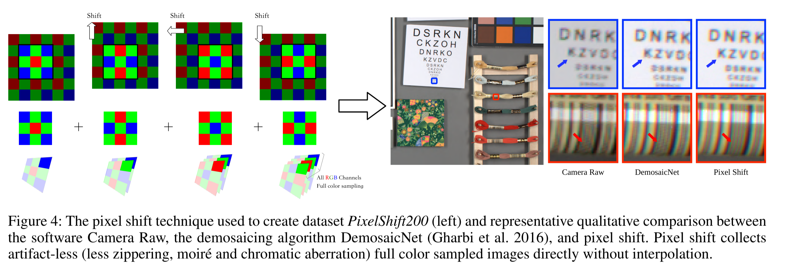
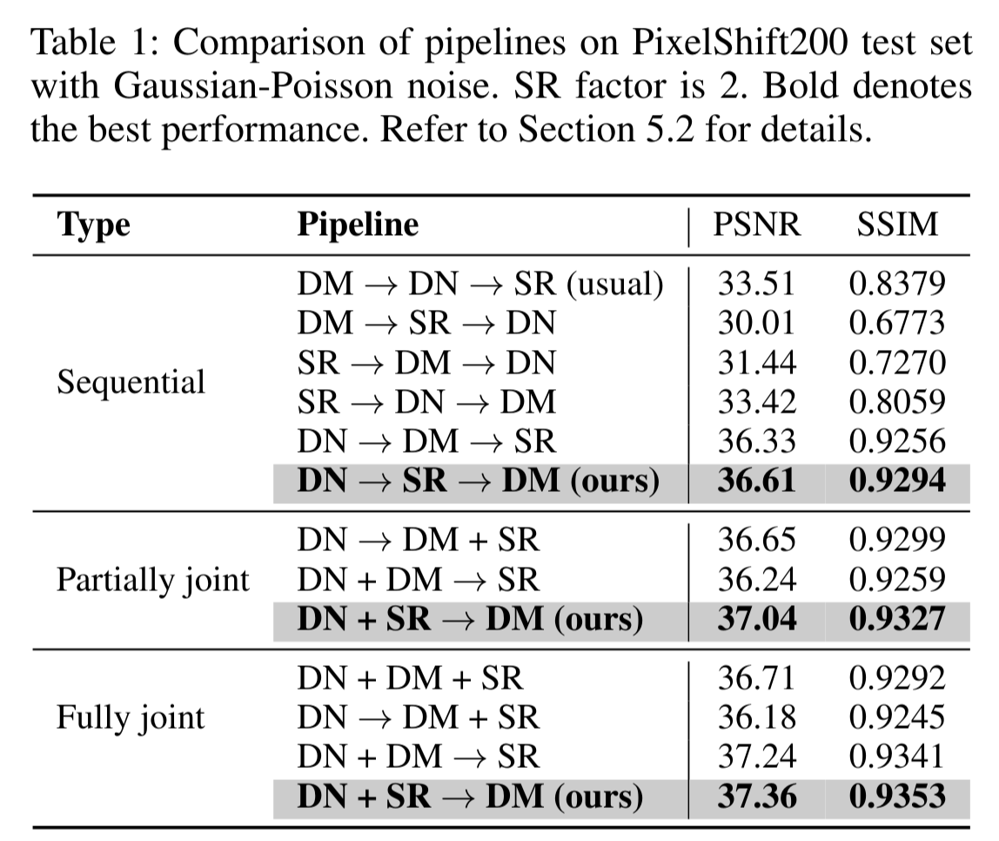

# TENet <a href="https://arxiv.org/abs/1905.02538" target="_blank">[ArXiv]</a> <a href="http://gcqian.com/project/pixelshift200">[pixelshift200]</a> 

### Rethinking Learning-based Demosaicing, Denoising, and Super-Resolution Pipeline
By [Guocheng Qian*](https://guochengqian.github.io/), [Yuanhao Wang*](https://github.com/yuanhaowang1213), [Jinjin Gu](http://www.jasongt.com/), Chao Dong, Wolfgang Heidrich, Bernard Ghanem, [Jimmy S. Ren](http://www.jimmyren.com/)

The original name of this project is: "Trinity of Pixel Enhancement: a Joint Solution for Demosaicking, Denoising and Super-Resolution"


## TENet

We insert the proposed pipeline DN -> SR -> DM into an end-to-end network constructed by RRDB for the joint DN, DM and SR. We leverage the detachable branch to provide the middle stage supervision. 


<p align="center">
  
</p>


## PixelShift200 dataset

We employ advanced pixel shift technology to perform a full color sampling of the image.
Pixel shift technology takes four samples of the same image, and physically controls the camera sensor to move one pixel horizontally or vertically at each sampling to capture all color information at each pixel.
The pixel shift technology ensures that the sampled images follow the distribution of natural images sampled by the camera, and the full information of the color is completely obtained.
In this way, the collected images are artifacts-free, which leads to better training results for demosaicing related tasks.

<p align="center">
  
</p>  


Download dataset from [pxielshift200 website](http://gcqian.com/project/pixelshift200).


### Environment installation

Clone this github repo and install the environment by:

```bash
git clone https://github.com/guochengqian/TENet
cd TENet
source install.sh
conda activate tenet
```


### Data preparation

1. synthetic data preparation [Optional]
   Processing synthetic dataset if you are interested in synthetic benchmark.
   1. Download ([DIV2K](https://drive.google.com/file/d/1vXPPr2hVaMewz2JA1lFfI5uHB4ENwRXQ/view?usp=sharing)) dataset

   2. `mkdir data && cd data`

   3. Link DIV2K data into ./data/DIV2K, e.g. `ln -s /data/lowlevel/DIV2K ./` 

   4. Crop DIV2K
      
      ```bash
      cd ../datasets
      python crop_imgs.py # crop train images
      python crop_imgs.py --src_dir ../data/DIV2K/DIV2K_val5_HR --save_dir ../data/DIV2K/DIV2K_val5_HR_sub # crop val5 images
      ```

2. PixelShift200 data preparation 
   Processing PixelShift200 dataset if you are interested in PixelShift200 benchmark.
   1. Download [Pixelshift200](http://guochengqian.com/pixelshift200). They are .mat format, having 4 channels (R, Gr, Gb, B). Unzip the .zip file and put all folders inside into one folder called pixelshift200. For example, put here `/data/lowlevel/pixelshift200`. 

   2. `cd TENet && mkdir data && cd data`

   3. Link PixelShift200 data into ./data/pixelshift200, e.g. `ln -s /data/lowlevel/pixelshift200 pixelshift200` 

   4. Crop images into 512*512, and generate the text file that contains the location of each image:

      ```bash
      cd ../datasets
      python crop_pixelshift200.py 
      python generate_datalist_pixelshift.py 
      ```


## Training
#### Train  joint  models

* DN+SR->DM (our **TENet**)

  ```bash
  python train.py --in_type noisy_lr_raw --mid_type raw --out_type linrgb --model tenet --n_gpus 4 --block rrdb  --n_blocks 12
  ```

* DN+DM+SR [Optional] (baseline: end to end without pipeline)

  ```bash
  python train.py --in_type noisy_lr_raw --mid_type None --out_type linrgb --model tenet --n_gpus 4 --block rrdb --n_blocks 12
  ```

  Note: 

  1.  `--mid_type raw` is to activate the auxiliary mid stage supervision. Here we add `raw` as the supervision, therefore, the pipeline will be DN+SR->DM

  2.  for training on a different dataset, like DIV2K, change `--dataset div2k` 
   
  3.  for training with Gaussian noise model, add `--noise_model g`

  4.  for using a different building block, such as NLSA `--block nlsa`, or EAM `--block eam` , or RRG `--block rrg`, or DRLM `--block drlm` or RRDB `--block rrdb`

  5.   [`wandb`](https://wandb.ai/) is used by default. Set `--no_wandb` to not using wandb 


#### Train sequential models [Optional] (ablation study) 

```bash
# RawDN
python train.py --in_type noisy_raw --out_type raw --model resnet --train_list datasets/train_pixelshift.txt --val_list datasets/val_pixelshift.txt --n_gpus 4  --use_wandb --block rrdb --n_blocks 12

# RawSR
python train.py --in_type lr_raw --out_type raw --model resnet --train_list datasets/train_pixelshift.txt --val_list datasets/val_pixelshift.txt --n_gpus 4  --use_wandb --block rrdb --n_blocks 12

# DM
python train.py --in_type raw --out_type linrgb --model resnet --train_list datasets/train_pixelshift.txt --val_list datasets/val_pixelshift.txt --n_gpus 4  --use_wandb --block rrdb --n_blocks 12

# RGBDN
python train.py --in_type noisy_linrgb --out_type linrgb --model resnet --train_list datasets/train_pixelshift.txt --val_list datasets/val_pixelshift.txt --n_gpus 4  --use_wandb --block rrdb --n_blocks 12

# RGBSR
python train.py --in_type lr_linrgb --out_type linrgb --model resnet --train_list datasets/train_pixelshift.txt --val_list datasets/val_pixelshift.txt --n_gpus 4  --use_wandb --block rrdb --n_blocks 12
```


### Train SOTA models [Optional]
We also support training previous work. 

* JDSR
  ```bash
  python train.py --in_type noisy_lr_raw --mid_type None --out_type linrgb --model jdsr --train_list datasets/train_pixelshift.txt --val_list datasets/val_pixelshift.txt --n_gpus 4  --use_wandb --block res --n_blocks 12 --channels 256
  ```

* JDnDmSR

  ```bash
  python train.py --in_type noisy_lr_raw --mid_type lr_raw --out_type linrgb --model jdndmsr --scale 2 --train_list datasets/train_pixelshift.txt --val_list datasets/val_pixelshift.txt --n_gpus 4 --n_blocks 2 --block rcab
  ```


## Testing

```bash
bash script_all_pipelines.sh 
```
This script supports evaluation on all benchmarking datasets as well as the real-shot images for all possible pipelines. Check this script for details 


Note: for the real shot images testing, you have to:

1.  save the real-shot image as a readable raw image (like in .RAW, .ARW, .DNG format).  For example,  we use Lightroom mobile version to shot images on iPhone and save the photo in .DNG format.
2. Read the general metadata using RawPy and read the noise profiling metadata using [Jeffrey's Image Metadata Viewer](http://exif.regex.info/exif.cgi) or [metapicz](http://metapicz.com/). 


## Result
<p align="center">
  
</p>


### Citation 

Please cite the following paper if you feel TENet and PixelShift200 is useful to your research

```
@article{qian2019rethink,
  title={Rethink the Pipeline of Demosaicking, Denoising, and Super-resolution},
  author={Qian, Guocheng and Wang, Yuanhao and Gu, Jinjin and Dong, Chao and  Heidrich, Wolfgang and Ghanem, Bernard and Ren, Jimmy S},
  journal={arXiv preprint arXiv:1905.02538},
  year={2019}
}
```
